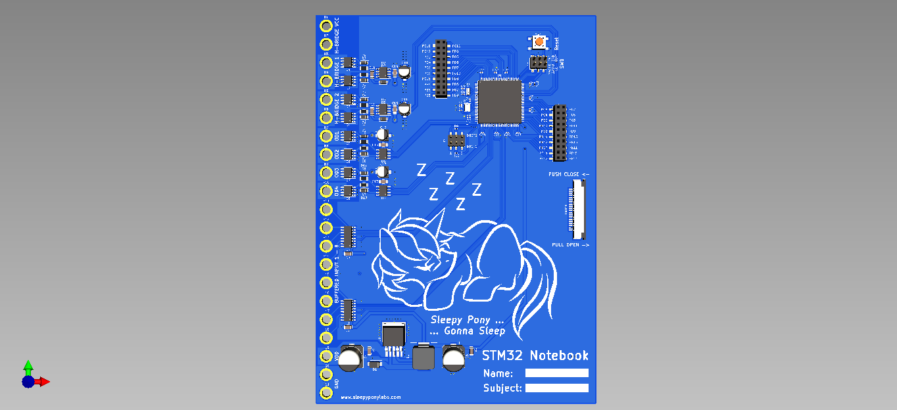
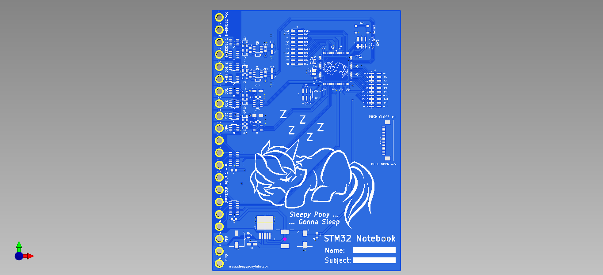
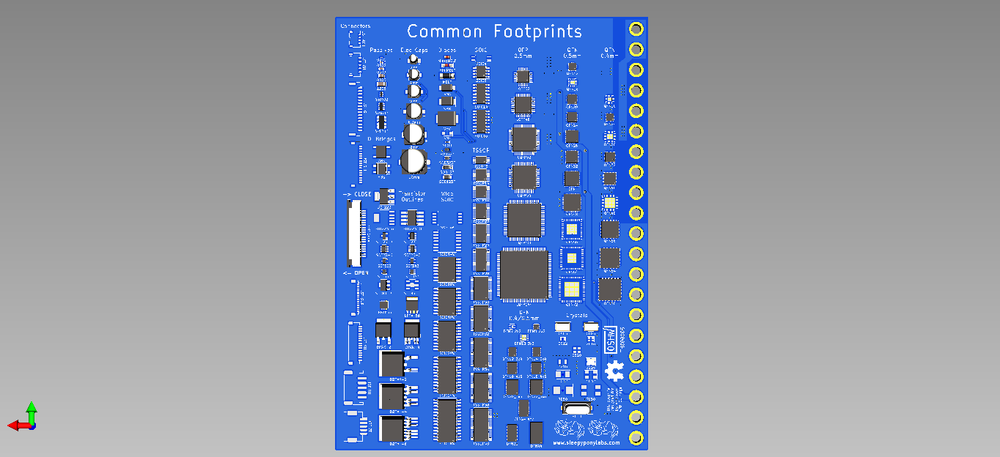
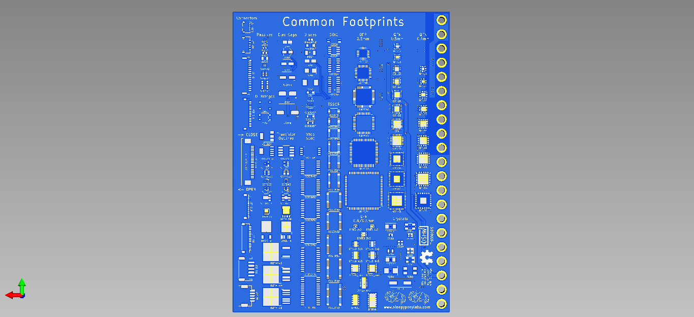

# STM32 Notebook

This is an STM32 dev board that is designed to be put on a B6 ring binder notebook as covers. The board size is 130x180mm and contains 21 4mm ring holes.

**Note: I did tried to follow best practices as much as possible while designing this board, but it is still intended to be used as a notebook cover. The devices fitted might not work to their fullest spec. Please exercise caution.**

## Features - Front

The front side is the devboard. Featuring:

 - An STM32F103ZCT6 ARM-Cortex M3 Microcontroller in a 144-pin LQFP package
 - External 16MHz crystal and 32.768kHz RTC crystal
 - 2x IRS2003 H-Bridge Drivers with a pair of IRF7403 MOSFET (total of 2 drivers)
 - 2x PM8834 MOSFET Drivers with two IRF7403 MOSFETs in an Open-Drain configuration (total of 4 drivers)
 - 2x CD4050 Buffer for translating higher voltage logic inputs into STM32's 3.3v logic (total of 8 inputs)
 - 40x IO pins breakout
 - BOOT0/BOOT1 headers
 - SWD headers
 - Reset button
 - LM2596S-3.3 Buck Converter
 - Cute ponies

## Features - Back

The back side is a PCB footprint reference guide. Featuring:

 - Passive components (0201 to 1206)
 - Electrolytic Capacitors (3mm to 10mm)
 - JST connectors (GH, SH, PH, ...)
 - Diodes (MELF, SMA, SMB, SOD123, SOD323, ...)
 - Diode Bridges (ABS, MBS)
 - Transistors (SOT23, SOT223, LFPAK56, DPAK, ...)
 - Crystals (HC49, 0603 to 7050, 2 and 4 pins versions)
 - SOICs (SOIC4, SOIC8, SOIC14, SOIC16)
 - Wide SOICs (SOIC8W to SOIC28W)
 - TSSOPs (TSSOP8 to TSSOP40)
 - QFPs 0.5mm pitch (LQFP32 to LQFP144)
 - DFNs 0.4mm and 0.5mm pitch (DFN6 to DFN44)
 - QFNs 0.4mm pitch (QFN20 to QFN76)
 - QFNs 0.5mm pitch (QFN12 to QFN72)
 - More cute ponies
 
 ## Features - Latch
 
 This board features a pair of 20-pin Slide-Lock FFP Connectors, one on each side. These connectors are there so you can add a 20-pin Same-Side FFC Cable to act as a notebook closing strap.
 
 ## Licenses
 
 Hardware is licensed under `SPDX-License-Identifier: Apache-2.0 WITH SHL-2.1`
 
 This project is a certified Open Source Hardware. OSHWA UID TH000006.
 https://certification.oshwa.org/th000006.html
 
 ## Credits

 - 3215 Crystal model by Sam Ma: https://grabcad.com/library/crystal-smd-3215-pin2-1
 - Inductor model by Gydius: https://grabcad.com/library/inductor-wurth-elektronik-74437324100-1
